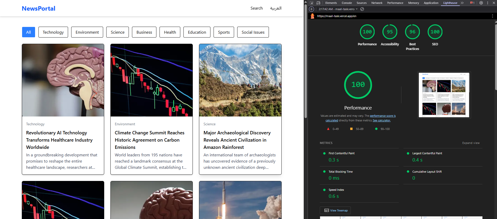

# Next.js News App

A modern **Next.js 13+** news application built with **TypeScript** and **Server Components**, featuring:

- News listing with category filtering and pagination
- Article details pages with related articles
- Search functionality with highlighted keywords
- SEO-friendly setup including metadata, Open Graph, robots.txt, and sitemap.xml

---

## **Table of Contents**

1. [Features](#features)  
2. [Project Structure](#project-structure)  
3. [Pages](#pages)  
4. [Components](#components)  
5. [SEO Setup](#seo-setup)  
6. [Getting Started](#getting-started)  
7. [Future Improvements](#future-improvements)  

---

## **Features**

- **Home Page:** Grid of 12 news items per page with category filter and pagination  
- **News Detail Page:** Full article content with 3 related articles  
- **Search Page:** Search results with keyword highlighting and "no results" state  
- **Server Components:** All pages are server-rendered, no client-side state required  
- **SEO Ready:** Metadata, Open Graph, robots.txt, and sitemap.xml for search engines  




---

## **Pages**

### **1. Home Page**
- URL: `/`  
- Features:
  - Grid display of news (3 columns on desktop, 1 on mobile)
  - Category filter
  - Pagination  
- Fully server-rendered using query parameters for category and page (`/?category=Technology&page=1`)  

### **2. News Detail Page**
- URL: `/news/[id]`  
- Features:
  - Full article content
  - Related articles (up to 3)
  - Metadata and Open Graph for SEO  
- Example: `/news/1`  

### **3. Search Page**
- URL: `/search?q=keyword`  
- Features:
  - Search by title or description
  - Highlight matching keywords
  - "No results" message when no matches found  

---

## **Components**

- **NewsCard:** Displays image, title, short description, and category  
- **Pagination:** Server-side pagination links using query parameters  
- Both components are TypeScript-based and fully reusable  

---

## **SEO Setup**

- **robots.txt** placed in `/public`:

```txt
User-agent: *
Allow: /
Sitemap: https://yourdomain.com/sitemap.xml
sitemap.xml placed in /public or generated dynamically:

Includes Home Page, Categories, News Detail Pages, and important search keywords

Meta Tags & Open Graph included in News Detail pages using Next.js Metadata API

Getting Started
Install dependencies:

bash
Copy code
npm install
# or
yarn install
Run development server:

bash
Copy code
npm run dev
# or
yarn dev
Visit the app:

Home: http://localhost:3000/

News Detail: http://localhost:3000/news/1

Search: http://localhost:3000/search?q=AI

Future Improvements
Dynamic search result pagination

Fetch real data from a news API instead of dummy data

Add user authentication and saved articles

Improve styling with Tailwind CSS or other design system

